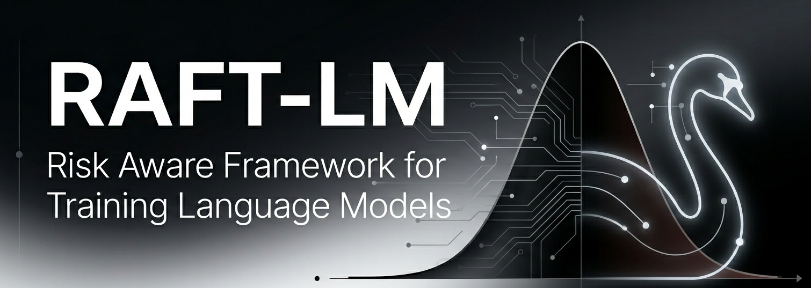

<p align="center">
  
</p>

# RAFT-LM

**Risk-Aware RL Framework for Training and Aligning Language Models** — hybrid RL (DPO, PPO-LM, GRPO, env PPO/DQN), extensible rewards, supervised risk training, and RAG/BYOK inference.

[](https://github.com/artaasd95/raft-lm/actions/workflows/ci.yml)
[](https://www.python.org/downloads/)
[](LICENSE)

**Repository:** [github.com/artaasd95/raft-lm](https://github.com/artaasd95/raft-lm)

## Why RL + risk + inference

| Plane | What | Entry |
|-------|------|-------|
| **Training** | SFT → DPO/KTO → PPO-LM/GRPO + classical env RL | `scripts/train.py` + `configs/methods/` |
| **Rewards** | Composable YAML reward recipes | `src/rewards/`, `configs/rewards/` |
| **Inference** | RAG + BYOK/local + optional LoRA | `scripts/infer.py`, `src/rag/` |

LoRA default: **`transformers` + `peft`**. Unsloth optional for SFT only.

## Algorithms

| Method | Backend | Config |
|--------|---------|--------|
| Supervised risk (MLP) | `mlp` | `configs/risk_training.yaml` |
| SFT LoRA (PEFT) | `peft` | `model.type: hf_lora` |
| SFT LoRA (Unsloth) | `unsloth` | `configs/training/unsloth_lora_example.yaml` |
| DPO / KTO | `dpo` / `kto` | `configs/methods/dpo_risk.yaml` |
| PPO-LM / GRPO | `ppo_lm` / `grpo` | `configs/methods/ppo_lm.yaml` |
| Env PPO / DQN | `ppo_env` / `dqn_env` | `configs/methods/ppo_env.yaml` |

## Quick start

```bash
pip install -e '.[dev,benchmark]'
pip install -e '.[hf]'    # LoRA / alignment
pip install -e '.[docs]'    # Sphinx docs

# Supervised risk baseline
python scripts/train.py --config configs/risk_training.yaml

# Classical env RL smoke
python scripts/train.py --config configs/methods/ppo_env.yaml

# DPO preference (stub without hub download)
python scripts/train.py --config configs/methods/dpo_risk.yaml

# Inference
python scripts/infer.py --query "What is CVaR at 95%?"
```

## Documentation

Build Sphinx site:

```bash
cd docs && pip install -r requirements-docs.txt && make html
```

| Doc | Purpose |
|-----|---------|
| [docs/getting-started.md](docs/getting-started.md) | Install, train vs infer |
| [docs/training/lora-peft.md](docs/training/lora-peft.md) | PEFT LoRA path |
| [docs/rewards/design.md](docs/rewards/design.md) | Reward framework |
| [docs/adr/0003-hybrid-rl-architecture.md](docs/adr/0003-hybrid-rl-architecture.md) | Architecture ADR |

## Benchmark results (TBD)

| Method | Task | Metric | Seeds |
|--------|------|--------|-------|
| CE baseline | Risk MLP | Accuracy | 3 |
| PPO env | RiskAllocationEnv | Mean reward | 3 |
| DPO | Preference pairs | DPO loss | 3 |

See [docs/benchmarks/BENCHMARK.md](docs/benchmarks/BENCHMARK.md).

## Project layout

| Area | Path |
|------|------|
| RL core | `src/rl/`, `src/alignment/` |
| Rewards | `src/rewards/` |
| Training backends | `src/training/backends/` |
| LoRA loader | `src/models/loaders/causal_peft.py` |
| RAG / BYOK | `src/rag/`, `src/llm_integration/` |
| Method configs | `configs/methods/` |

## License

Apache License 2.0 — see [LICENSE](LICENSE).
