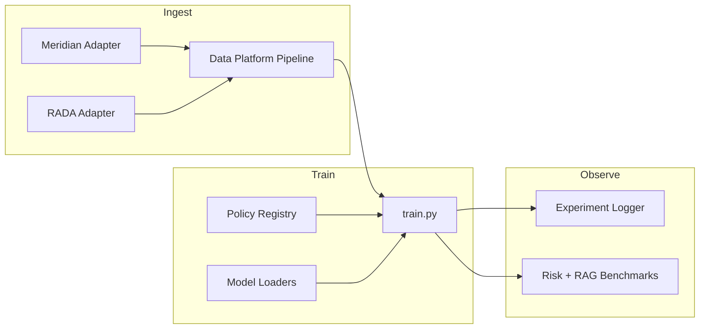

# Agent Stack Definitions — RAFT-LM Training Path

Aligned with [Project-Hub.md](../Project-Hub.md) and **RF-2026-28**. Agents below are **logical roles** for automation and human operators — not production microservices.

## Training-path stack

## Role catalog

| Agent / role | Responsibility | Primary artifacts |
|--------------|----------------|-------------------|
| **Data Curator** | Run `build_dataset.py`, validate cards (`EngineLabelRow`, etc.) | `configs/data/*.yaml`, `data/processed/` |
| **Label Steward** | Ensure engine labels map to risk domains and optimizer targets | `src/data_platform/cards.py`, engine config |
| **Training Operator** | Launch `train.py` with experiment + optional `--data-config` | `experiments/configs/`, policies |
| **Policy Author** | Register train/eval policies (loss weights, constraints) | `src/training/policies/`, `experiments/configs/policies/` |
| **Eval Analyst** | Run risk metrics (`evaluate.py`) and RAG benchmark harness | `docs/benchmarks/results/` |
| **Experiment Archivist** | Persist runs via `BaseExperimentLogger` backends | `experiments/results/`, W&B/Comet optional |

## Adapter agents (portfolio)

| Agent | Project | Inputs | Outputs to data platform |
|-------|---------|--------|--------------------------|
| **Meridian Scout** | Meridian | Scenarios, features, stress tags | Normalized feature rows → enrich stage |
| **RADA Annotator** | RADA | Decisions, preferences, tool traces | `PreferencePair`, `ToolCallExample`, `FeedbackRecord` |

## Explicitly deprioritized (S6 superseded)

| Role | Former focus | Disposition |
|------|--------------|-------------|
| **RAG Dashboard Operator** | Multi-pipeline UI expansion | Frozen demo only (`src/demo/streamlit_app.py`) |
| **Corpus Expander** | New RAG corpora beyond `financial_policy_v1` | Defer until risk-training slice ships |

## Handoff contracts

- **Data platform → training:** Processed splits under `data/processed/<pipeline_id>/` or in-memory build via `--data-config`.
- **Policy registry → training:** `policy_id` in experiment config resolves loss/metric/constraint bundle.
- **Training → benchmark:** Risk-training benchmark uses engine-label holdout; RAG benchmark unchanged per [BENCHMARK.md](../../benchmarks/BENCHMARK.md).
